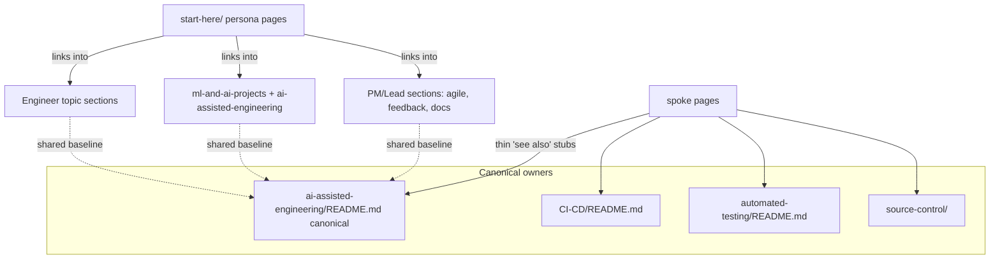

<!-- markdownlint-disable-file -->
# Task Research: Repository Restructure to Reduce Guide Duplication

Analyze the Code-With Engineering Playbook repository, identify duplicated guidance across the docs, and propose a restructure that minimizes duplication and improves navigability for three personas: engineer, project manager (PM), and data scientist.

## Task Implementation Requests

* Analyze the repo and catalog the existing guides/content.
* Find duplications across the guides.
* Propose a restructure that minimizes duplicates and is easier to read and reason about.
* Make navigation easier for three personas: engineer, project manager, data scientist.

## Scope and Success Criteria

* Scope: Documentation content under `docs/` plus navigation config (`mkdocs.yml`, `docs/.pages`, `_config.yml`), READMEs, and cross-linking. Excludes generated `site/` output and `resources/` (image assets only).
* Assumptions:
  * The repository is a MkDocs Material documentation site whose navigation is driven by the `awesome-pages` plugin via `.pages` files (not hard-coded in `mkdocs.yml`).
  * Restructure should preserve content value; the goal is reorganization + dedup, not deletion of guidance.
  * Personas map primarily to entry-point/navigation needs; topic sections remain the canonical home for content.
  * The site is published with external inbound links, so URL-changing moves carry redirect cost.
* Success Criteria:
  * Concrete list of duplicated/overlapping guides with evidence (paths + line numbers). ✅ (11 findings)
  * A proposed information architecture (folder + navigation) organized for the three personas. ✅
  * Clear rationale and migration impact for the selected approach. ✅

## Outline

1. Repository facts: site type, nav mechanism, intended organizing principle.
2. Section catalog (15 content sections + 4 loose top-level files).
3. Duplication findings (11, prioritized).
4. Persona → section mapping and navigation pain points.
5. Technical scenarios / alternatives for restructure.
6. Selected approach: persona entry layer + canonical hub-and-spoke dedup + (optional) naming normalization.

## Potential Next Research

* Quantify exact duplicated line counts per finding before a consolidation PR.
  * Reasoning: Sizing the edit and proving "true DUP vs PARTIAL" precisely.
  * Reference: `.copilot-tracking/research/subagents/2026-06-16/duplication-research.md`
* Confirm `mkdocs-redirects` availability before proposing any folder renames.
  * Reasoning: Renaming `CI-CD`/`UI-UX` changes published URLs; redirects avoid breakage.
  * Reference: `mkdocs.yml` plugins list (only `search`, `git-revision-date-localized`, `awesome-pages`).
* Map every `engineering-fundamentals-checklist.md` item to its canonical section guide.
  * Reasoning: The checklist is the de-facto taxonomy; aligning nav to it reduces ambiguity.
  * Reference: `docs/engineering-fundamentals-checklist.md`.
* Audit `recipes/`/`templates/` folders for a consistent Diátaxis how-to/reference split.
  * Reasoning: A latent how-to layer already exists and could be normalized.

## Research Executed

### File Analysis

* `docs/README.md`, `docs/engineering-fundamentals-checklist.md`
  * Site identity: "ISE Engineering Fundamentals Playbook". The checklist is the canonical taxonomy and maps almost 1:1 onto the docs folders (Source Control, Work Item Tracking, Testing, CI/CD, AI-Assisted Engineering, Security, Observability, Agile/Scrum, Design Reviews, Code Reviews, Retrospectives, Engineering Feedback, Developer Experience).
* `mkdocs.yml` (lines 1-37)
  * MkDocs + Material; plugins `search`, `git-revision-date-localized`, `awesome-pages`; theme feature `navigation.indexes` enabled (folder README acts as index). No `nav:` block — navigation is data-driven by `.pages` files.
* `docs/.pages` (lines 1-9)
  * Top-level nav order pins README, Checklist, First Week, ISE, Agile Development, Automated Testing, CI/CD, then `...` (awesome-pages auto-fills the rest alphabetically), then UI/UX. Purely topic-based, no persona grouping.
* `_config.yml`
  * Minimal Jekyll fallback (`jekyll-theme-slate`); does not define navigation.
* `docs/the-first-week-of-an-ise-project.md`
  * De-facto onboarding path, sequenced by sprint cadence for the whole team (not per persona).

### Code Search Results

* CI/CD "Fundamentals" five-bullet list
  * `docs/CI-CD/README.md` lines 26-32 and `docs/agile-development/branching-and-cicd.md` lines 60-66 — near-verbatim despite an existing cross-reference.
* AI-assisted baseline ("treat output as untrusted draft", "named human owner", 8-item threat list, "don't paste secrets")
  * Restated across `docs/ai-assisted-engineering/README.md` (hub), `docs/developer-experience/copilots.md`, `docs/automated-testing/README.md`, `docs/security/README.md`, `docs/source-control/README.md`, `docs/code-reviews/README.md`. Threat list verbatim in 3 places.
* Testing taxonomy ("no code without tests" + unit/integration/e2e/performance)
  * `docs/automated-testing/README.md`, `docs/CI-CD/continuous-integration.md`, `docs/engineering-fundamentals-checklist.md`, `docs/agile-development/team-agreements/definition-of-done.md`, `docs/non-functional-requirements/maintainability.md`, `docs/agile-development/branching-and-cicd.md`.
* OpenTelemetry blurb verbatim in `docs/observability/correlation-id.md`, `pillars/tracing.md`, `microservices.md`.

### External Research

* Diátaxis IA framework (tutorials/how-to/reference/explanation): https://diataxis.fr/
  * Relevant because the playbook is mostly explanation + how-to with little tutorial/reference separation; `recipes/` and `templates/` folders are a partial, inconsistent how-to layer.

### Project Conventions

* Organizing principle: "Engineering Fundamentals" with the checklist as canonical index.
* Navigation convention: `awesome-pages` `.pages` files + folder `README.md` index pages (`navigation.indexes`).
* Naming drift observed: `CI-CD`, `UI-UX` (UPPER-hyphen) vs `ml-and-ai-projects`, `agile-development` (kebab); `design/readme.md` lowercase; `Images` vs `images`.

## Key Discoveries

### Project Structure

The site has **15 content sections** + 4 loose top-level files + 1 asset-only folder (`resources/`). Full catalog (with file counts and overlap notes) is in `.copilot-tracking/research/subagents/2026-06-16/repo-catalog-research.md`. Summary by size:

| Section | ~md files | Persona primary | Notes / overlap |
|---|---|---|---|
| design/ | ~36 | Engineer | `design/readme.md` lowercase; NFR-capture guide overlaps NFR section |
| CI-CD/ | ~29 | Engineer | dev-sec-ops + gitops + recipes; secrets overlap source-control |
| observability/ | ~26 | Engineer | ml-observability + logs-privacy overlap other sections |
| automated-testing/ | ~24 | Engineer | canonical testing; restated elsewhere |
| code-reviews/ | ~22 | Engineer (+PM process) | PR guidance canonical |
| documentation/ | ~21 | PM/shared | guidance/* duplicates owning sections |
| agile-development/ | ~21 | PM | ceremonies, backlog, roles, team-agreements; branching-and-cicd overlaps CI-CD |
| non-functional-requirements/ | ~19 | shared | NO section README; overlaps design/security/observability |
| ml-and-ai-projects/ | ~15 | Data Scientist | embeds a PM guide; overlaps ai-assisted-engineering |
| developer-experience/ | ~10 | Engineer | copilots.md overlaps ai-assisted-engineering |
| source-control/ | 7 | Engineer | branching overlaps agile + CI-CD; secrets overlap CI-CD |
| engineering-feedback/ | 4 | PM | voice-of-customer |
| security/ | 4 | shared | most secrets content actually lives in CI-CD/dev-sec-ops |
| UI-UX/ | 2 | Engineer (UI) | mostly links into NFR |
| ai-assisted-engineering/ | 1 | shared (Eng+DS) | cross-cutting hub, restated by spokes |
| resources/ | 0 | — | image asset only; renders empty in nav |

Loose top-level files: `docs/README.md`, `docs/engineering-fundamentals-checklist.md`, `docs/the-first-week-of-an-ise-project.md`, `docs/ISE.md`.

### Duplication Findings (prioritized)

Full evidence with line numbers: `.copilot-tracking/research/subagents/2026-06-16/duplication-research.md`. Classification: **DUP** = near-verbatim, **PARTIAL** = same advice/different wording, **XREF** = good canonical+link pattern.

1. **AI-assisted engineering baseline (HIGH, most pervasive — PARTIAL/DUP).** Same principles (untrusted draft, named human owner, no secrets in prompts, 8-item AI threat list) re-articulated across 7+ files: `ai-assisted-engineering/README.md` (hub), `developer-experience/copilots.md` (L104-160), `automated-testing/README.md` (L18-30), `security/README.md` (L13-25), `source-control/README.md` (L13-20), `code-reviews/README.md` (L13-25). Hub-and-spoke exists but spokes restate rather than link → wordings already diverge.
2. **CI/CD "Fundamentals" five-bullet list (HIGH — DUP).** `docs/CI-CD/README.md` L26-32 vs `docs/agile-development/branching-and-cicd.md` L60-66, near-verbatim despite existing cross-reference (L59).
3. **Testing fundamentals taxonomy (MEDIUM-HIGH — PARTIAL).** "No code without tests" + unit/integration/e2e/performance restated in ≥6 files (automated-testing, CI-CD/continuous-integration, checklist, definition-of-done, maintainability, branching-and-cicd). `continuous-integration.md` L190-246 re-explains E2E in depth, overlapping `automated-testing/e2e-testing/`.
4. **Branching + PR-merge workflow (MEDIUM — PARTIAL).** Branch protection / required reviewers / required CI before merge described in 4+ places: `source-control/git-guidance/README.md` L83-148, `source-control/README.md` L28-40, `agile-development/branching-and-cicd.md` L7-18, `CI-CD/continuous-integration.md` L222-235, `code-reviews/pull-requests.md` L3-14.
5. **Merge-gate checklist (MEDIUM — PARTIAL).** Same "CI passes + ≥1 reviewer + linked work item + docs updated" gate as prose in source-control, checklist in `branching-and-cicd.md` L36-41, first-week task L58, and machine config `github_conf/branch_protection_rules.json`.
6. **Secrets management split (MEDIUM — mostly XREF).** `source-control/secrets-management.md` (stub) → `CI-CD/dev-sec-ops/secrets-management/` (canonical) + `CI-CD/gitops/secret-management/`. Two top-level sections own "secrets" surface area.
7. **PR guidance (MEDIUM — XREF, GOOD).** `documentation/guidance/pull-requests.md` is a thin stub deferring to `code-reviews/pull-requests.md`. Positive pattern to replicate.
8. **Onboarding / first-week / fundamentals checklist (MEDIUM — PARTIAL).** Competing entry points: `the-first-week-of-an-ise-project.md`, `developer-experience/README.md` L132-136 + `onboarding-guide-template.md`, `engineering-fundamentals-checklist.md`.
9. **Agile ceremonies / DoD (LOW-MEDIUM — XREF + PARTIAL).** ML agile + first-week correctly link to `ceremonies.md` anchors (good), but Definition of Done is restated across 5+ agile sub-docs.
10. **Observability OpenTelemetry blurb (LOW — DUP, localized).** Identical recommendation text verbatim in `correlation-id.md` L30, `pillars/tracing.md` L22, `microservices.md` L55.
11. **Threat modeling AI list (LOW — PARTIAL/XREF).** `security/threat-modelling.md` canonical; AI threat enumeration duplicated into `security/README.md` and `ai-assisted-engineering/README.md`.

Suggested canonical owners for any consolidation: CI/CD fundamentals → `CI-CD/README.md`; testing taxonomy → `automated-testing/README.md`; AI baseline → `ai-assisted-engineering/README.md`; PRs → `code-reviews/pull-requests.md`; branching → `source-control/`; secrets → `CI-CD/dev-sec-ops/secrets-management/`.

### Persona → Section Mapping

Full table: `.copilot-tracking/research/subagents/2026-06-16/personas-navigation-research.md`. Relevance ●●● core / ●●○ secondary / ●○○ occasional.

| Section | Engineer | PM / Lead | Data Scientist |
|---|---|---|---|
| source-control | ●●● | ●○○ | ●●○ |
| code-reviews | ●●● | ●●○ | ●●○ |
| automated-testing | ●●● | ●○○ | ●●○ |
| CI-CD | ●●● | ●○○ | ●●○ |
| security | ●●● | ●●○ | ●●○ |
| design | ●●● | ●●○ | ●●○ |
| observability | ●●● | ●○○ | ●●○ |
| developer-experience | ●●● | ●○○ | ●●○ |
| non-functional-requirements | ●●○ | ●●○ | ●●○ |
| documentation | ●●○ | ●●● | ●●○ |
| agile-development | ●●○ | ●●● | ●●○ |
| engineering-feedback | ●●○ | ●●● | ●●○ |
| engineering-fundamentals-checklist | ●●● | ●●● | ●●○ |
| the-first-week-of-an-ise-project | ●●○ | ●●● | ●●○ |
| ai-assisted-engineering | ●●● | ●●○ | ●●● |
| ml-and-ai-projects | ●○○ | ●●○ | ●●● |
| UI-UX | ●●○ | ●○○ | ●○○ |

* **Engineer primary:** source-control → code-reviews → automated-testing → CI-CD → security → design → observability → developer-experience (the bulk of the site), with ai-assisted-engineering as shared baseline.
* **PM/Lead primary:** agile-development, engineering-feedback, the-first-week, the checklist, documentation; plus process facets of code-reviews/security/design and the ML PM guide.
* **Data Scientist primary:** ml-and-ai-projects + ai-assisted-engineering, layered on shared fundamentals (source-control, automated-testing, CI-CD, security, observability).
* **Cross-cutting/shared:** ai-assisted-engineering, engineering-fundamentals-checklist, non-functional-requirements, security, documentation, design reviews. `ml-and-ai-projects` even embeds a PM sub-guide (`tpm-considerations-for-ml-projects.md`).

### Navigation Pain Points

1. **No persona entry points** — nav is purely topic-based + alphabetical (`docs/.pages` pins 4 pages, then `...`). No "For Engineers / Leads / Data Scientists".
2. **No per-persona "start here"** — only `the-first-week-of-an-ise-project.md` is onboarding, but it mixes roles into one sprint timeline.
3. **Scattered related guides** — AI guidance split across `ai-assisted-engineering/`, `ml-and-ai-projects/`, and AI subsections in security/observability/automated-testing; PM content spans 4+ top-level peers.
4. **Inconsistent folder casing** — `CI-CD`/`UI-UX` vs kebab-case; `Images` vs `images`; `design/readme.md` vs `README.md`.
5. **Deep nesting** in example/recipe trees (depth 5-6 under `design/design-reviews/decision-log/...`, `CI-CD/recipes/github-actions/...`).
6. **Unused infrastructure** — `navigation.indexes` + `awesome-pages` are enabled, so persona landing/index pages are easy to add but currently absent.
7. **Structural mismatches** — `non-functional-requirements/` has no section README; `resources/` renders empty in nav; checklist treats Work Item Tracking / Retrospectives / Design Reviews as top-level fundamentals though they are sub-pages.

## Technical Scenarios

### Scenario A: Persona entry layer + canonical hub-and-spoke dedup (SELECTED)

A two-part, low-risk restructure that adds a persona-oriented orientation layer on top of the existing topic-based IA while collapsing duplicated prose into canonical sources referenced by thin stubs.

**Requirements:**

* Preserve existing topic sections as canonical content homes (avoid URL churn / broken inbound links).
* Add persona navigation without moving content.
* Replace restated duplicate prose with links to a single canonical owner.
* Use already-enabled `awesome-pages` + `navigation.indexes`.

**Preferred Approach:**

* **Part 1 — Persona entry layer (navigation only, no content moves).** Add a `docs/start-here/` folder with four index pages and surface them at the top of `docs/.pages`:
  * `start-here/README.md` — "How to use this playbook" + persona selector + the existing checklist/first-week links.
  * `start-here/for-engineers.md` — curated ordered reading path into source-control → code-reviews → automated-testing → CI-CD → security → design → observability → developer-experience (+ ai-assisted-engineering baseline).
  * `start-here/for-leads.md` (PM/Eng Lead) — agile-development → the-first-week → engineering-fundamentals-checklist → engineering-feedback → documentation → governance facets of code-reviews/security/design.
  * `start-here/for-data-scientists.md` — ml-and-ai-projects → ai-assisted-engineering → shared fundamentals (testing-data-science-and-mlops-code, security, observability/ml-observability, CI-CD/MLOps).
  Each persona page is a thin curated list of links into existing canonical content (no duplication of guidance — it is a reading path, not a copy).
* **Part 2 — Canonical hub-and-spoke deduplication.** For each HIGH/MEDIUM duplication finding, keep ONE canonical owner and replace restated copies with a short "see [canonical]" stub (the proven pattern from `documentation/guidance/pull-requests.md`):
  * AI baseline → canonical `ai-assisted-engineering/README.md`; spokes (copilots, automated-testing, security, source-control, code-reviews) link to specific anchors instead of restating the threat list / principles.
  * CI/CD fundamentals → canonical `CI-CD/README.md`; `agile-development/branching-and-cicd.md` defers via link.
  * Testing taxonomy → canonical `automated-testing/README.md`; checklist/DoD/maintainability keep one-line summaries that link out.
  * Branching/merge-gate → canonical `source-control/` (workflow) + `code-reviews/pull-requests.md` (PR policy); other pages link.
  * Secrets → canonical `CI-CD/dev-sec-ops/secrets-management/`; source-control stub already correct.
  * OpenTelemetry blurb → canonical `observability/tools/OpenTelemetry.md`; other 2 files link.
* **Part 3 — Structural cleanups (low risk, no URL change for most):** add a `non-functional-requirements/README.md` index; rename `design/readme.md` → `README.md`; drop empty `resources/` from nav (keep asset).

```text
docs/
  start-here/                     # NEW persona entry layer (nav only)
    README.md                     # "How to use this playbook" + persona selector
    for-engineers.md              # curated reading path (links only)
    for-leads.md                  # PM / Eng Lead path (links only)
    for-data-scientists.md        # DS / ML path (links only)
  engineering-fundamentals-checklist.md   # unchanged (canonical taxonomy)
  the-first-week-of-an-ise-project.md      # unchanged
  <all existing topic sections unchanged>  # canonical content homes
  non-functional-requirements/README.md    # NEW section index
  .pages                          # EDIT: add "Start Here" group at top
```



**Implementation Details:**

* `docs/.pages` gains a top "Start Here" entry pointing at `start-here/` (which becomes the site landing experience), then the existing checklist/first-week/ISE, then the topic sections grouped roughly in checklist order.
* Persona pages contain only headings + annotated links; they introduce zero new duplicated guidance.
* Dedup edits are surgical: replace a restated block with 1-2 sentences + a deep link to the canonical anchor. Net effect: fewer words, single source of truth, less divergence risk.
* No top-level folder is renamed in this scenario (casing normalization deferred to Scenario C as optional), so published URLs are preserved and no redirects are required.

```yaml
# docs/.pages (illustrative)
nav:
  - Start Here: start-here
  - Engineering Fundamentals Checklist: engineering-fundamentals-checklist.md
  - The First Week of an ISE Project: the-first-week-of-an-ise-project.md
  - Who is ISE?: ISE.md
  - Source Control: source-control
  - Code Reviews: code-reviews
  - Automated Testing: automated-testing
  - CI/CD: CI-CD
  - AI-Assisted Engineering: ai-assisted-engineering
  - Security: security
  - Observability: observability
  - Agile Development: agile-development
  - Design: design
  - Developer Experience: developer-experience
  - Documentation: documentation
  - Engineering Feedback: engineering-feedback
  - Non-Functional Requirements: non-functional-requirements
  - ML & AI Projects: ml-and-ai-projects
  - UI/UX: UI-UX
```

**Why selected:** Lowest risk for a published site, directly satisfies all four task requests (catalog ✓, dedup ✓, easier to reason ✓, persona navigation ✓), reuses already-enabled infrastructure, keeps topics as the single canonical home (so dedup and personas reinforce rather than fight each other), and orders the topic nav to match the canonical checklist taxonomy.

#### Considered Alternatives

* **Scenario B — Full persona-first reorganization (move content into `engineers/`, `leads/`, `data-scientists/`, `shared/`).** Physically relocates sections under persona roots.
  * Rejected: Most sections are multi-persona (table above), so physical placement forces duplication or arbitrary ownership; it changes nearly every published URL (large redirect burden via `mkdocs-redirects`, which is not currently configured); high churn for contributors who know the current taxonomy; contradicts the established "Engineering Fundamentals" organizing principle.
* **Scenario C — Naming/casing normalization + redirects (e.g., `CI-CD`→`ci-cd`, `UI-UX`→`ui-ux`, `Images`→`images`, `readme.md`→`README.md`).** Pure consistency pass.
  * Partially adopted: The zero-URL-change cleanups (add NFR README, fix `design/readme.md`, drop empty `resources/` from nav) are folded into Scenario A Part 3. The URL-changing renames are deferred as an optional follow-up requiring `mkdocs-redirects`, since they break inbound links and deliver cosmetic benefit only.
* **Scenario D — Diátaxis overlay (split every section into tutorials/how-to/reference/explanation).** Re-tag content by user need.
  * Rejected as primary: High effort across ~250 files, and the playbook is predominantly explanation+how-to; a full Diátaxis split would fragment content and increase navigation depth. Kept as a lightweight future option (the existing `recipes/`/`templates/` folders are a partial how-to layer that could be made consistent).
